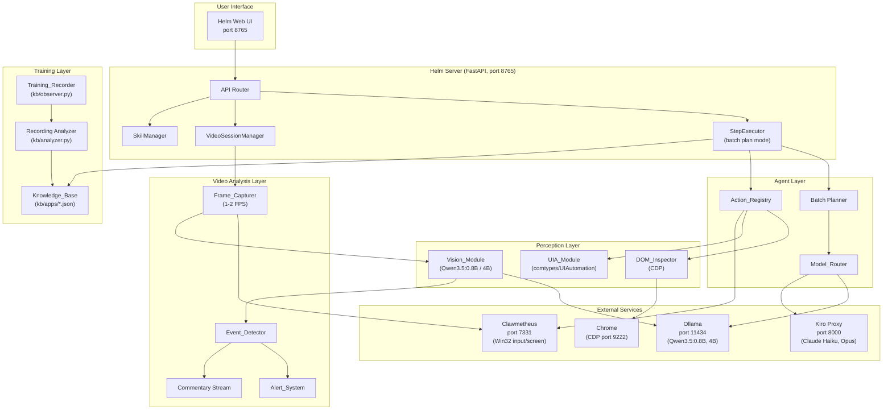
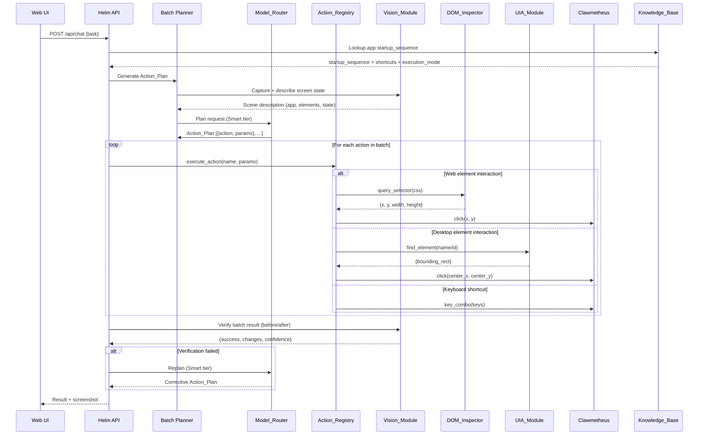
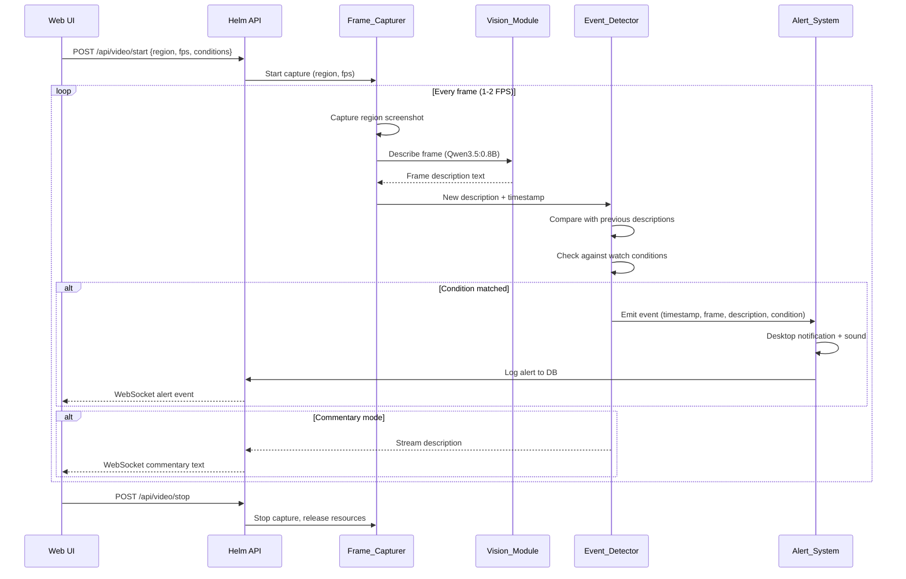

# Design Document: Helm V2 Rebuild

## Overview

Helm V2 is a ground-up rebuild of the desktop automation agent and the addition of a real-time video analysis system. The rebuild addresses five core problems in the current codebase:

1. **Broken web interaction** — Vision-based coordinate guessing replaced the working DevTools/DOM approach. V2 restores DOM inspection via Chrome DevTools Protocol (CDP) for precise web clicks.
2. **No desktop element discovery** — Mouse clicks on native apps rely on vision coordinates. V2 adds Windows UI Automation (UIA) for precise desktop element targeting.
3. **Excessive LLM calls** — The current step executor makes one LLM call per action (~2-3s each). V2 introduces batch action planning: plan N actions, execute them, then verify.
4. **Non-replayable training recordings** — `kb/observer.py` captures raw input events but doesn't produce replayable action sequences. V2 converts recordings into Action_Registry primitive sequences.
5. **No video analysis** — V2 adds continuous frame capture, vision-based description, event detection, and alerting.

The system runs on a single Windows 11 machine with an RTX 4070 Laptop (8GB VRAM), using Ollama for local models (Qwen3.5:0.8B + 4B), Kiro proxy for Claude, and Clawmetheus for low-level input/screen capture.

### What Changes vs. What's New

**Modified existing files:**
- `agent/models.py` — Add vision model routing (0.8B vs 4B selection), VRAM monitoring
- `agent/actions.py` — Add DOM_Inspector and UIA_Module action primitives, remove vision-coordinate clicking
- `agent/step_executor.py` — Replace per-step LLM calls with batch plan execution
- `core/screen.py` — Add region capture for Frame_Capturer
- `core/vision.py` — Replace Gemini-only with Ollama-first vision, add structured scene descriptions
- `kb/observer.py` — Extend Recording to produce replayable action sequences
- `kb/analyzer.py` — Generate Action_Registry primitives from recordings instead of just tips
- `web/server.py` — Mount new video analysis and alert routes
- `config.yaml` — Add video analysis, UIA, and DOM inspector config sections
- `db/models.py` — Add VideoSession, Alert, Skill tables

**New files:**
- `core/dom_inspector.py` — Chrome DevTools Protocol client for web element discovery
- `core/uia_module.py` — Windows UI Automation wrapper for desktop element discovery
- `video/frame_capturer.py` — Continuous screenshot capture at 1-2 FPS
- `video/event_detector.py` — Frame description comparison and condition matching
- `video/alert_system.py` — Desktop notifications, sound alerts, alert logging
- `video/commentary.py` — Streaming text description output
- `web/routes/video.py` — Video analysis session API endpoints
- `web/routes/alerts.py` — Alert history and configuration endpoints

## Architecture

### System Architecture Diagram



### Data Flow: Task Execution (Plan-Then-Execute)



### Data Flow: Real-Time Video Analysis



## Components and Interfaces

### 1. DOM_Inspector (`core/dom_inspector.py`) — NEW

Connects to Chrome via Chrome DevTools Protocol (CDP) on port 9222. Chrome must be launched with `--remote-debugging-port=9222`.

```python
class DOMInspector:
    """Chrome DevTools Protocol client for web element discovery."""

    async def connect(self, port: int = 9222) -> bool:
        """Connect to Chrome CDP. Returns True if connected."""

    async def disconnect(self):
        """Close CDP websocket connection."""

    async def query_selector(self, css: str) -> list[dict]:
        """Find elements by CSS selector.
        Returns: [{"nodeId": int, "x": int, "y": int, "width": int, "height": int, "text": str}, ...]
        """

    async def query_selector_one(self, css: str) -> dict | None:
        """Find first matching element. Returns bounding rect + text or None."""

    async def get_page_url(self) -> str:
        """Get current page URL."""

    async def evaluate_js(self, expression: str) -> any:
        """Execute JavaScript in page context. For complex DOM queries."""

    @property
    def connected(self) -> bool:
        """Whether CDP connection is active."""
```

Design decisions:
- Uses `websockets` library for CDP communication (lightweight, no Selenium/Playwright dependency)
- Element coordinates are returned in screen-space (adjusted for browser chrome offset)
- Connection is lazy — only connects when first web action is requested
- Falls back to UIA if CDP connection fails (Requirement 1.4)

### 2. UIA_Module (`core/uia_module.py`) — NEW

Windows UI Automation wrapper using `comtypes` and `UIAutomationCore`.

```python
class UIAModule:
    """Windows UI Automation for desktop app element discovery."""

    def find_element(self, name: str = None, automation_id: str = None,
                     control_type: str = None, window_title: str = None) -> dict | None:
        """Find a UI element. Returns {"name": str, "x": int, "y": int, "width": int, "height": int, "control_type": str} or None."""

    def find_all(self, control_type: str = None, window_title: str = None) -> list[dict]:
        """Find all matching elements in the active window."""

    def get_element_tree(self, window_title: str = None, max_depth: int = 3) -> dict:
        """Get the UI element tree for the active window. Cached per window_title."""

    def click_element(self, name: str = None, automation_id: str = None) -> bool:
        """Find element and click its center. Returns True if found and clicked."""

    def invalidate_cache(self, window_title: str = None):
        """Clear cached element tree (call after window state changes)."""
```

Design decisions:
- Element tree is cached per window title to avoid repeated tree walks (Requirement 4.4)
- Cache invalidated after each action batch completes
- 5-second timeout on element search before falling back to vision (Requirement 4.3)
- Uses `comtypes` for COM interop — standard approach on Windows, no extra dependencies

### 3. Vision_Module (modified `core/vision.py`)

Replaces the current Gemini-only implementation with Ollama-first routing.

```python
class VisionModule:
    """Screen understanding via local Qwen models. NOT for click coordinates."""

    def describe_screen(self, screenshot: bytes, detail: str = "fast") -> dict:
        """Structured scene description.
        detail="fast" → Qwen3.5:0.8B (<1s)
        detail="detailed" → Qwen3.5:4B (~5-10s)
        Returns: {"app": str, "elements": list[str], "state": str, "description": str}
        """

    def verify_action(self, before: bytes, after: bytes, expected: str) -> dict:
        """Compare before/after screenshots. Returns {"success": bool, "confidence": float, "changes": str}."""

    def describe_frame(self, frame: bytes) -> str:
        """Single frame description for video analysis. Uses 0.8B for speed.
        Returns plain text description including objects, people, actions, scene context.
        """

    def compare_frames(self, desc_prev: str, desc_current: str) -> dict:
        """Compare two frame descriptions. Returns {"changed": bool, "differences": list[str]}."""
```

Design decisions:
- `describe_screen` replaces `_ask_screen` with structured output instead of free-text
- Vision is NEVER used for click coordinates (Requirement 2.3) — that's DOM_Inspector and UIA_Module's job
- Model selection (0.8B vs 4B) is handled internally based on `detail` parameter
- Frame description uses 0.8B exclusively for <1s latency (Requirement 11.2)

### 4. Model_Router (modified `agent/models.py`)

Extends the existing tier system with vision model routing and VRAM awareness.

```python
# Existing tiers remain:
TIER_LOCAL = "local"    # Qwen via Ollama — action params, simple JSON
TIER_FAST = "fast"      # Claude Haiku — routine decisions
TIER_SMART = "smart"    # Claude Opus — complex planning, error recovery

# New vision tiers:
TIER_VISION_FAST = "vision_fast"      # Qwen3.5:0.8B — frame analysis, <1s
TIER_VISION_DETAILED = "vision_detail" # Qwen3.5:4B — detailed scene analysis

class ModelRouter:
    # ... existing complete() method ...

    def vision_complete(self, prompt: str, image_b64: str, tier: str = TIER_VISION_FAST) -> str:
        """Route vision request to appropriate Qwen model via Ollama."""

    def check_vram(self) -> dict:
        """Query Ollama for loaded models and VRAM usage.
        Returns {"used_gb": float, "models": list[str], "over_budget": bool}
        """

    def ensure_vram_budget(self):
        """If VRAM > 7.5GB, unload 4B model. (Requirement 15.4)"""
```

### 5. Frame_Capturer (`video/frame_capturer.py`) — NEW

```python
class FrameCapturer:
    """Continuous screenshot capture for video analysis."""

    def __init__(self, vision_module: VisionModule):
        self._vision = vision_module
        self._running = False
        self._task: asyncio.Task | None = None

    async def start(self, region: dict, fps: float = 1.0,
                    on_frame: Callable[[str, float, bytes], Awaitable[None]] = None):
        """Start capturing. region = {"x": int, "y": int, "width": int, "height": int}.
        on_frame callback receives (description, timestamp, frame_png).
        """

    async def stop(self):
        """Stop capture, release resources within 2 seconds."""

    @property
    def running(self) -> bool: ...

    @property
    def actual_fps(self) -> float:
        """Measured FPS over last 10 frames."""
```

Design decisions:
- Uses `mss` for region capture (same as existing `core/screen.py`) — fast, no extra deps
- Frame is sent to Vision_Module immediately after capture (<100ms, Requirement 10.3)
- Callback-based architecture — Frame_Capturer doesn't know about Event_Detector
- FPS is self-regulating: if vision takes >1s, capture rate drops gracefully (Requirement 10.4)

### 6. Event_Detector (`video/event_detector.py`) — NEW

```python
@dataclass
class DetectedEvent:
    timestamp: float
    frame_png: bytes
    description: str
    matched_condition: str
    confidence: float

class EventDetector:
    """Compares frame descriptions to detect events and changes."""

    def __init__(self, cooldown_secs: float = 30.0):
        self._conditions: list[str] = []
        self._history: deque[tuple[float, str]] = deque(maxlen=60)  # 30s at 2fps
        self._last_emitted: dict[str, float] = {}  # condition → last emit timestamp
        self._cooldown = cooldown_secs

    def set_conditions(self, conditions: list[str]):
        """Set watch conditions (e.g., ["coyote", "person at door", "package"])."""

    def process_frame(self, description: str, timestamp: float, frame_png: bytes) -> list[DetectedEvent]:
        """Check description against conditions. Returns events (empty if no match or in cooldown)."""

    def get_changes(self, description: str) -> list[str]:
        """Compare current description against previous. Returns list of differences."""
```

Design decisions:
- Sliding window of 30 seconds of descriptions (Requirement 12.3)
- Cooldown prevents duplicate alerts for ongoing conditions (Requirement 12.5)
- Condition matching uses substring + LLM semantic matching (0.8B) for fuzzy conditions
- `process_frame` is synchronous — called from Frame_Capturer's async loop

### 7. Alert_System (`video/alert_system.py`) — NEW

```python
@dataclass
class AlertRecord:
    id: str
    timestamp: float
    condition: str
    description: str
    frame_b64: str  # base64 PNG thumbnail
    batched_conditions: list[str] | None = None

class AlertSystem:
    """Desktop notifications, sounds, and alert logging."""

    def __init__(self, db_session_factory, batch_window_secs: float = 10.0):
        self._pending: list[DetectedEvent] = []
        self._batch_timer: asyncio.Task | None = None
        self._batch_window = batch_window_secs

    async def trigger(self, event: DetectedEvent):
        """Handle a detected event. Batches alerts within 10s window (Requirement 13.4)."""

    async def _flush_batch(self):
        """Send batched notification, play sound, log to DB."""

    def _desktop_notify(self, title: str, body: str):
        """Windows toast notification via win10toast or plyer."""

    def _play_sound(self):
        """Play alert sound via winsound."""

    async def get_history(self, limit: int = 50) -> list[AlertRecord]:
        """Get recent alerts from DB."""
```

### 8. Training_Recorder (modified `kb/observer.py` + `kb/analyzer.py`)

The existing `Observer` class captures raw input events. The modification adds conversion to Action_Registry primitives.

```python
# In kb/analyzer.py — new function:
def recording_to_skill(recording: Recording, app_db: AppDB) -> dict:
    """Convert a recording into a replayable skill (sequence of Action_Registry primitives).
    Returns: {"name": str, "app": str, "steps": [{"action": str, "params": dict}, ...]}
    Uses Smart tier LLM to interpret raw events + screenshots into action primitives.
    """

# In kb/observer.py — Recording gets a new method:
class Recording:
    def to_skill(self, app_db: AppDB = None) -> dict:
        """Convert this recording to a replayable skill. Delegates to analyzer."""
```

### 9. Batch Planner (modified `agent/step_executor.py`)

Replaces the current per-step LLM loop with batch planning.

```python
class StepExecutor:
    async def _plan_batch(self, task: str, screen_state: dict, kb_context: dict) -> list[dict]:
        """Generate a batch Action_Plan using Smart tier.
        Returns: [{"action": str, "params": dict}, ...]
        """

    async def _execute_batch(self, plan: list[dict]) -> list[ActionResult]:
        """Execute all actions in sequence WITHOUT LLM calls between steps."""

    async def _verify_batch(self, before: bytes, after: bytes, expected: str) -> dict:
        """Vision verification of batch result."""

    async def run(self, task: str) -> AsyncIterator:
        """Main execution loop:
        1. Get KB context (startup_sequence, shortcuts, execution_mode)
        2. If app not running, execute startup_sequence
        3. Capture screen, describe state
        4. Plan batch (Smart tier)
        5. Execute batch (no LLM calls)
        6. Verify result (Vision)
        7. If failed, replan (Smart tier)
        8. Repeat until done or max iterations
        """
```
