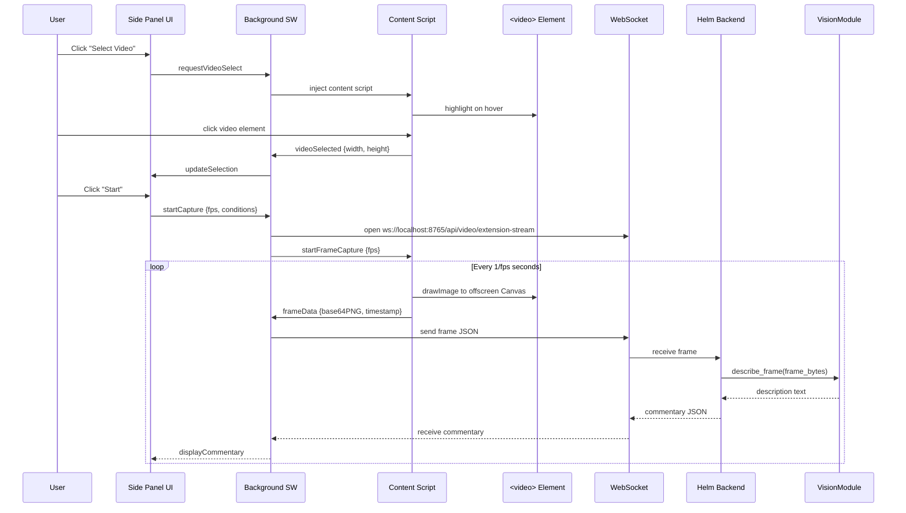
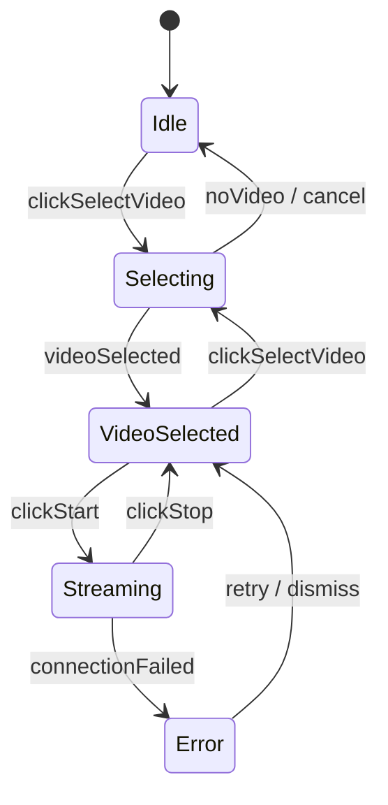

# Design Document: Video Vision Extension

## Overview

This design covers a Chrome extension (Manifest V3) and corresponding backend modifications that enable real-time AI-powered video description from any `<video>` element on a web page. The extension captures frames directly from the DOM via the Canvas API, streams them over WebSocket to the Helm backend, and displays live AI commentary in a Chrome side panel.

The key architectural shift is moving from the existing mss-based screen capture (which requires the target window to be visible and on-screen) to extension-injected Canvas capture, which works regardless of window position, overlapping windows, or background tabs.

### Data Flow



## Architecture

The system has two major components: the Chrome extension and the Helm backend additions.

### Chrome Extension (extension/)

The extension follows a standard Manifest V3 architecture with three execution contexts:

1. **Service Worker (background.js)** — Manages the WebSocket connection to the backend, relays messages between the content script and side panel, and handles Chrome notifications. This is the only context that maintains the WebSocket because content scripts cannot open WebSocket connections to arbitrary hosts without CSP issues, and the side panel lifecycle is tied to its visibility.

2. **Content Script (content.js)** — Injected on-demand via `chrome.scripting.executeScript` when the user activates video selection. Handles video element highlighting, selection, and frame capture via Canvas API. Communicates with the service worker via `chrome.runtime.sendMessage` / `chrome.runtime.onMessage`.

3. **Side Panel (panel.html + panel.js + panel.css)** — The persistent UI showing controls, live commentary feed, alert configuration, TTS controls, and connection status. Communicates with the service worker via `chrome.runtime.sendMessage` / `chrome.runtime.onMessage`.

### Backend Additions

A new WebSocket endpoint `/api/video/extension-stream` is added to `web/routes/video.py`. Unlike the existing `/video/stream` endpoint (which is a read-only commentary consumer), this new endpoint is bidirectional:

- **Inbound**: Receives base64 PNG frames + timestamps from the extension
- **Outbound**: Sends commentary entries, alert flags, and status messages back

The endpoint creates per-session instances of `EventDetector`, `AlertSystem`, and `CommentaryStream` so that extension sessions are isolated from any mss-based capture session that might be running concurrently.

### Why Per-Session Instances

The existing `app.state` singletons (`frame_capturer`, `event_detector`, etc.) are shared across the mss-based capture pipeline. Extension sessions need their own pipeline instances to avoid cross-contamination of commentary streams, alert conditions, and event cooldowns. Each WebSocket connection to `/api/video/extension-stream` creates its own `EventDetector`, `CommentaryStream`, and reuses the shared `AlertSystem` (since desktop notifications are a global resource).

## Components and Interfaces

### Extension Components

#### manifest.json
```json
{
  "manifest_version": 3,
  "name": "Helm Video Vision",
  "version": "1.0.0",
  "description": "Real-time AI video description powered by local Helm backend",
  "permissions": ["sidePanel", "activeTab", "scripting", "notifications"],
  "host_permissions": ["ws://localhost:8765/*"],
  "side_panel": {
    "default_path": "panel.html"
  },
  "background": {
    "service_worker": "background.js"
  },
  "icons": {
    "128": "icons/icon128.png"
  },
  "action": {
    "default_title": "Helm Video Vision"
  }
}
```

#### Service Worker (background.js) Interface

```typescript
// Message types from content script → background
interface VideoSelectedMsg {
  type: "videoSelected";
  width: number;
  height: number;
  thumbnail: string; // base64 PNG
}

interface FrameDataMsg {
  type: "frameData";
  frame: string;     // base64 PNG
  timestamp: number;  // Unix epoch seconds
}

interface CaptureErrorMsg {
  type: "captureError";
  reason: string;
}

// Message types from side panel → background
interface StartCaptureMsg {
  type: "startCapture";
  fps: number;
  conditions: string[];
}

interface StopCaptureMsg {
  type: "stopCapture";
}

interface RequestVideoSelectMsg {
  type: "requestVideoSelect";
}

// Message types from background → side panel
interface CommentaryMsg {
  type: "commentary";
  description: string;
  timestamp: number;
  alert?: { condition: string };
}

interface StatusMsg {
  type: "status";
  connection: "disconnected" | "connecting" | "connected" | "error";
  message?: string;
}

interface VideoInfoMsg {
  type: "videoInfo";
  width: number;
  height: number;
  thumbnail: string;
}

interface NoVideoMsg {
  type: "noVideo";
}
```

#### Content Script (content.js) Interface

The content script exposes no public API. It listens for messages from the background service worker:

- `{ action: "activateSelector" }` — Enter video selection mode (highlight on hover, click to select)
- `{ action: "startCapture", fps: number }` — Begin frame capture loop on the selected video
- `{ action: "stopCapture" }` — Stop frame capture loop
- `{ action: "cleanup" }` — Remove all overlays and event listeners

#### Side Panel (panel.js) State Machine



### Backend Components

#### New WebSocket Endpoint

Added to `web/routes/video.py`:

```python
@router.websocket("/video/extension-stream")
async def extension_stream(websocket: WebSocket):
    """Bidirectional WebSocket for Chrome extension frame streaming.
    
    Inbound messages:
      {"type": "frame", "data": "<base64 PNG>", "timestamp": 1234567890.123}
      {"type": "configure", "conditions": ["coyote", "person"]}
      {"type": "stop"}
    
    Outbound messages:
      {"type": "commentary", "description": "...", "timestamp": 1234567890.123}
      {"type": "commentary", "description": "...", "timestamp": ..., "alert": {"condition": "coyote"}}
      {"type": "error", "message": "..."}
    """
```

#### Context-Aware Description

A new helper function `describe_frame_with_context` wraps `VisionModule.describe_frame` to inject previous descriptions into the prompt:

```python
def describe_frame_with_context(
    vision: VisionModule,
    frame: bytes,
    recent_descriptions: list[str],  # last 3
) -> str:
    """Describe a frame with awareness of previous scene state."""
```

This modifies the prompt sent to the LLM to include the last 3 descriptions and instructs the model to focus on changes rather than re-describing the entire scene.


## Data Models

### WebSocket Message Protocol

All messages between the extension and backend are JSON objects with a `type` field.

#### Extension → Backend

| Field | Type | Description |
|-------|------|-------------|
| `type` | `"frame"` \| `"configure"` \| `"stop"` | Message type discriminator |
| `data` | `string` | Base64-encoded PNG frame (only for `type: "frame"`) |
| `timestamp` | `number` | Unix epoch seconds (only for `type: "frame"`) |
| `conditions` | `string[]` | Alert watch phrases (only for `type: "configure"`) |

#### Backend → Extension

| Field | Type | Description |
|-------|------|-------------|
| `type` | `"commentary"` \| `"error"` \| `"status"` | Message type discriminator |
| `description` | `string` | AI-generated scene description (for `type: "commentary"`) |
| `timestamp` | `number` | Unix epoch seconds (for `type: "commentary"`) |
| `alert` | `{ condition: string }` \| `undefined` | Present when an alert condition matched |
| `message` | `string` | Error or status message text |

### Extension Internal State

```typescript
interface ExtensionState {
  // Video selection
  selectedVideo: boolean;
  videoWidth: number;
  videoHeight: number;
  thumbnail: string;           // base64 PNG of current frame

  // Capture session
  capturing: boolean;
  fps: number;                 // 0.5–2.0, default 1.0
  captureIntervalId: number | null;

  // WebSocket
  connection: "disconnected" | "connecting" | "connected" | "error";
  reconnectAttempts: number;   // 0–5
  ws: WebSocket | null;

  // Commentary
  commentaryLog: CommentaryEntry[];

  // Alerts
  alertConditions: string[];

  // TTS
  ttsEnabled: boolean;
  ttsVoice: string;
  ttsRate: number;             // 0.5–2.0, default 1.0
}

interface CommentaryEntry {
  description: string;
  timestamp: number;
  alert?: { condition: string };
}
```

### Backend Session State

Each active extension WebSocket connection maintains:

```python
@dataclass
class ExtensionSession:
    """Per-connection state for an extension stream session."""
    event_detector: EventDetector
    commentary_stream: CommentaryStream
    description_history: deque  # maxlen=10, sliding window
    active: bool = True
```

The `AlertSystem` is shared from `app.state.alert_system` since desktop notifications are a global resource and batching should apply across all sources.

### Frame Capture Sizing

The content script resizes captured frames before encoding:

```
max_dimension = 1024  // pixels
if (video.videoWidth > max_dimension || video.videoHeight > max_dimension) {
    scale = max_dimension / Math.max(video.videoWidth, video.videoHeight)
    canvas.width = video.videoWidth * scale
    canvas.height = video.videoHeight * scale
}
```

This keeps base64 payload size manageable (~100-300 KB per frame at 1024px) while preserving enough detail for the vision model.


## Correctness Properties

*A property is a characteristic or behavior that should hold true across all valid executions of a system — essentially, a formal statement about what the system should do. Properties serve as the bridge between human-readable specifications and machine-verifiable correctness guarantees.*

### Property 1: Frame encoding round-trip

*For any* valid PNG byte sequence, encoding it to base64 on the client and decoding it on the backend should produce byte-identical PNG data that `VisionModule.describe_frame` can process without error.

**Validates: Requirements 2.2, 4.2**

### Property 2: Frame resize preserves aspect ratio with max dimension

*For any* video element with dimensions (W, H) where either W > 1024 or H > 1024, the resized canvas dimensions should satisfy: `max(outW, outH) <= 1024` and `abs(outW/outH - W/H) < 0.01` (aspect ratio preserved within rounding tolerance).

**Validates: Requirements 2.6**

### Property 3: Frame message JSON structure

*For any* captured frame, the JSON message sent over the WebSocket should contain a `type` field equal to `"frame"`, a `data` field that is a non-empty string, and a `timestamp` field that is a positive number.

**Validates: Requirements 3.2**

### Property 4: Reconnect exponential backoff timing

*For any* reconnection attempt number N (1 ≤ N ≤ 5), the delay before that attempt should equal `2^(N-1)` seconds (i.e., 1s, 2s, 4s, 8s, 16s).

**Validates: Requirements 3.4**

### Property 5: Commentary pipeline delivery

*For any* non-duplicate description produced by `VisionModule.describe_frame`, the description should appear in the `CommentaryStream` and be sent back to the extension client as a JSON message containing `type: "commentary"`, the description text, and a timestamp.

**Validates: Requirements 4.3, 4.4, 3.3**

### Property 6: Connection status validity

*For any* state transition in the extension, the displayed connection status should always be one of exactly four values: `"disconnected"`, `"connecting"`, `"connected"`, or `"error"`.

**Validates: Requirements 5.4**

### Property 7: Commentary history completeness

*For any* sequence of N distinct commentary entries received during a session, the history log should contain exactly N entries in the order they were received.

**Validates: Requirements 5.2, 5.3**

### Property 8: Alert condition detection flags messages

*For any* description string and any set of alert conditions, if the description contains a condition as a case-insensitive substring, the outbound commentary message should include an `alert` field with the matched condition.

**Validates: Requirements 6.4**

### Property 9: Alert conditions transmitted to backend

*For any* non-empty list of configured alert conditions, the `configure` message sent to the backend at session start should contain all conditions from the list, with no additions or omissions.

**Validates: Requirements 6.3**

### Property 10: Sliding window bounded size

*For any* sequence of N descriptions pushed to the session history where N > 10, the sliding window should contain exactly 10 entries, and they should be the last 10 descriptions in insertion order.

**Validates: Requirements 7.1**

### Property 11: Context prompt includes recent descriptions

*For any* session with K previous descriptions where K ≥ 3, the prompt sent to `VisionModule` should include exactly the last 3 descriptions from the sliding window as context.

**Validates: Requirements 7.2**

### Property 12: Duplicate description suppression

*For any* sequence of consecutive identical description strings pushed to `CommentaryStream`, only the first should be forwarded to consumers; subsequent duplicates should be silently dropped.

**Validates: Requirements 7.4**

### Property 13: Numeric configuration range clamping

*For any* numeric configuration value (FPS or speech rate), the effective value should be clamped to the range [0.5, 2.0]. Values below 0.5 should become 0.5, values above 2.0 should become 2.0.

**Validates: Requirements 2.3, 8.5**

## Error Handling

### Extension Errors

| Error Scenario | Handling |
|---|---|
| No `<video>` elements on page | Display "No video elements found" in Side Panel. Return to Idle state. |
| Video element removed from DOM | MutationObserver detects removal → stop capture → notify Side Panel with "Video element was removed" status. |
| Video source changes | `src` attribute change detected → stop capture → notify Side Panel. |
| WebSocket connection refused | Set status to "Connecting", begin exponential backoff reconnect (up to 5 attempts). |
| All reconnect attempts exhausted | Set status to "Error", stop frame capture, display "Cannot reach Helm backend" message. |
| Content script injection fails | `chrome.scripting.executeScript` rejection → display "Cannot access this page" in Side Panel. Chrome internal pages (chrome://, chrome-extension://) are not injectable. |
| Frame capture Canvas error | CORS-tainted video elements throw `SecurityError` on `drawImage`. Display "Cannot capture this video (cross-origin)" in Side Panel. |
| Notifications permission denied | Display inline prompt in Side Panel: "Enable notifications for alerts". Alerts still appear in the commentary feed, just without desktop notifications. |

### Backend Errors

| Error Scenario | Handling |
|---|---|
| Invalid base64 in frame message | Log warning, send `{"type": "error", "message": "Invalid frame data"}` back to client, skip frame. |
| VisionModule.describe_frame fails | Log exception, send `{"type": "error", "message": "Vision analysis failed"}` back to client, continue accepting next frame. |
| Ollama not running / unreachable | `describe_frame` returns empty string → CommentaryStream ignores empty descriptions → no commentary sent. Backend logs the connection error. |
| Client disconnects without stop | `WebSocketDisconnect` exception caught → clean up `ExtensionSession` (stop commentary stream, clear history). Cleanup within 5 seconds. |
| Malformed JSON from client | `json.JSONDecodeError` caught → send error message back, continue listening. |

## Testing Strategy

### Unit Tests

Unit tests cover specific examples, edge cases, and integration points:

- **Manifest validation**: Verify manifest.json contains required permissions, MV3 format, correct name/icon
- **Message format**: Verify frame and commentary JSON messages have correct structure
- **Video selector**: Test that no-video-found case produces correct message
- **Frame resize edge cases**: Test exact 1024px input (no resize needed), 1x1 pixel input, very large dimensions
- **Reconnect exhaustion**: Test that after 5 failed attempts, state transitions to "error"
- **DOM removal detection**: Test that MutationObserver fires correctly when video element is removed
- **Cross-origin canvas error**: Test that SecurityError from tainted canvas is caught and reported
- **Backend endpoint lifecycle**: Test stop message triggers cleanup, test ungraceful disconnect triggers cleanup
- **Empty description handling**: Test that empty strings from VisionModule are not pushed to CommentaryStream

### Property-Based Tests

Property-based tests validate universal properties across randomized inputs. Use `fast-check` for JavaScript (extension) tests and `hypothesis` for Python (backend) tests.

Each property test must:
- Run a minimum of 100 iterations
- Reference its design property with a comment tag
- Use a single property-based test per correctness property

**JavaScript (fast-check) — Extension properties:**

- **Feature: video-vision-extension, Property 2: Frame resize preserves aspect ratio** — Generate random (width, height) pairs, verify resize output satisfies max dimension and aspect ratio constraints
- **Feature: video-vision-extension, Property 3: Frame message JSON structure** — Generate random base64 strings and timestamps, verify message construction
- **Feature: video-vision-extension, Property 4: Reconnect exponential backoff** — Generate attempt numbers 1–5, verify delay = 2^(N-1)
- **Feature: video-vision-extension, Property 6: Connection status validity** — Generate random state transitions, verify status is always one of the four valid values
- **Feature: video-vision-extension, Property 7: Commentary history completeness** — Generate random sequences of commentary entries, verify history length and order
- **Feature: video-vision-extension, Property 13: Numeric config range clamping** — Generate random floats, verify clamping to [0.5, 2.0]

**Python (hypothesis) — Backend properties:**

- **Feature: video-vision-extension, Property 1: Frame encoding round-trip** — Generate random byte sequences, encode to base64, decode, verify equality
- **Feature: video-vision-extension, Property 5: Commentary pipeline delivery** — Generate random descriptions, push through pipeline, verify CommentaryStream output
- **Feature: video-vision-extension, Property 8: Alert condition detection** — Generate random descriptions and condition lists, verify alert flags match substring presence
- **Feature: video-vision-extension, Property 9: Alert conditions transmitted** — Generate random condition lists, verify configure message content
- **Feature: video-vision-extension, Property 10: Sliding window bounded size** — Generate random description sequences of length > 10, verify window contains last 10
- **Feature: video-vision-extension, Property 11: Context prompt includes recent descriptions** — Generate description sequences of length ≥ 3, verify last 3 appear in prompt
- **Feature: video-vision-extension, Property 12: Duplicate description suppression** — Generate sequences with consecutive duplicates, verify only first of each run is emitted
